# Introduction

## Table de hachage

Une table de hachage est une structure de données qui utilise une fonction de hachage pour associer des clés à des valeurs. Elle est souvent utilisée pour stocker de grandes quantités de données qui doivent être accessibles rapidement. L'opération de hachage calcule un index à partir de la clé, qui est ensuite utilisé pour accéder à la valeur correspondante dans la table. Les opérations de recherche, d'insertion et de suppression ont toutes une complexité moyenne de **O(1)**, ce qui signifie qu'elles sont très efficaces pour les grandes quantités de données.

## Arbre binaire de recherche

Un arbre binaire de recherche est une structure de données qui organise les données en utilisant une hiérarchie de noeuds. Chaque noeud a une clé et une valeur, et les noeuds sont organisés de telle sorte que les clés plus petites se trouvent à gauche et les clés plus grandes à droite. Cela permet une recherche rapide des données, car chaque recherche peut être effectuée en suivant une branche de l'arbre en fonction de la valeur de la clé. Les opérations de recherche, d'insertion et de suppression ont une complexité de **O(log n)** dans le pire des cas, où n est le nombre de noeuds dans l'arbre.

## Comparaison des complexités algorithmiques

La complexité de la table de hachage est de **O(1)** pour les opérations de recherche, d'insertion et de suppression, tandis que celle de l'arbre binaire de recherche est de **O(log n)** dans le pire des cas.
Toutefois, la complexité de la table de hachage peut être pire dans le pire des cas, lorsque plusieurs clés doivent être hachées sur le même index. Dans ce cas, la complexité devient **O(n)**.

## Comparaison des performances

Les performances des tables de hachage et des arbres binaires de recherche peuvent varier en fonction de nombreux facteurs, tels que la taille des données, la distribution des clés, le nombre d'opérations effectuées, etc.
Les arbres binaires de recherche peuvent offrir une meilleure performance dans certaines situations, en particulier lorsque les données sont déjà triées ou lorsque la distribution des clés est prévisible. De plus, cette structure de données offre la possibilité de parcourir les données en ordre croissant ou décroissant, ainsi que la possibilité de rechercher des valeurs approximatives ou des plages de valeurs.

En ce qui concerne l'utilisation de la mémoire, les tables de hachage peuvent nécessiter plus de mémoire que les arbres binaires de recherche en raison de la nécessité de stocker les index de hachage en plus des données elles-mêmes.

## Modélisation des données

Grâce à une implémentation en Python, nous pouvons ainsi modéliser les performances de ces deux structures de données.

---

## Arbre binaire de recherche

Le jeu de test utilisé pour l'arbre binaire de recherche est le suivant :

- 15 arbres où 500 valeurs aléatoires comprises entre 0 et 10000 sont insérés pour chaque arbre
- 50,000 recherches d'un élément compris entre 0 et 10000 pour chaque arbre
- Récupération du temps de recherche pour chaque arbre et calcul du temps moyen.

**Résultats :**

Pour 10 essais, le temps de recherche moyen pour **50,000** valeurs, comprise entre 0 et 10000 dans un arbre ayant une hauteur moyenne de 19 et comprenant des valeurs entre 0 et 10000, est de **0.10881** secondes

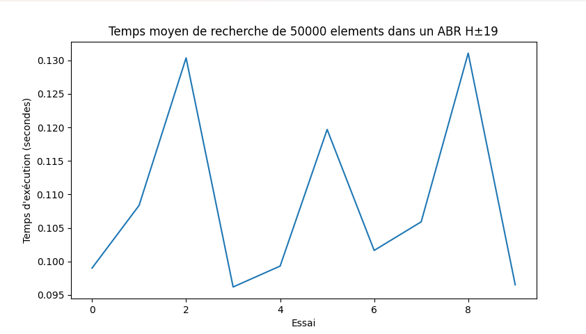

Pour 10 essais, le temps de recherche moyen pour **100,000** valeurs, comprise entre 0 et 10000 dans un arbre ayant une hauteur moyenne de 19 et comprenant des valeurs entre 0 et 10000, est de **0.22394** secondes

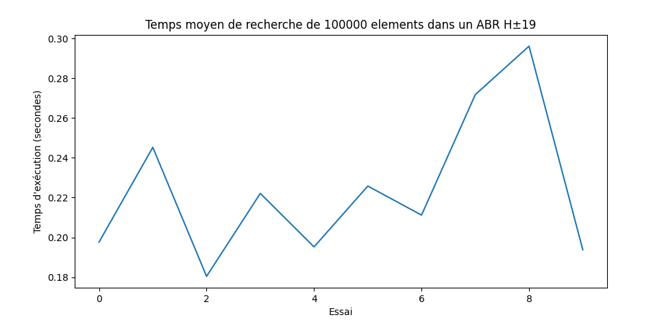

Pour 10 essais, le temps de recherche moyen pour **500,000** valeurs, comprise entre 0 et 10000 dans un arbre ayant une hauteur moyenne de 18 et comprenant des valeurs entre 0 et 10000, est de **1.01852** secondes

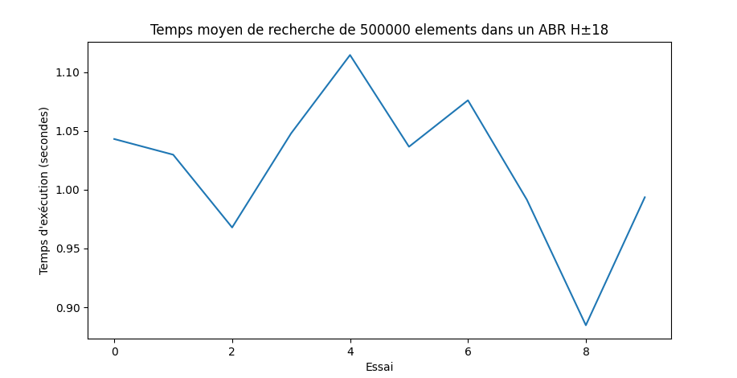

Pour 10 essais, le temps de recherche moyen pour **1,000,000** valeurs, comprise entre 0 et 10000 dans un arbre ayant une hauteur moyenne de 18 et comprenant des valeurs entre 0 et 10000, est de **2.01407** secondes

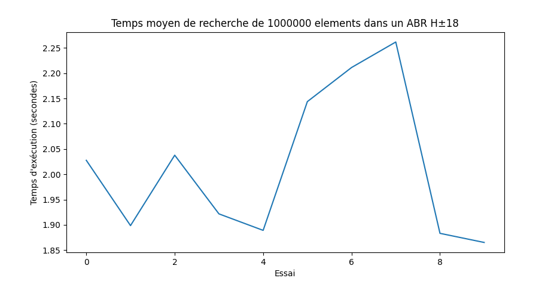

---

## Table de hashage

Le jeu de test utilisé pour l'arbre binaire de recherche est le suivant :

- 15 tables de taille 1000 ayant des valeurs comprises entre 0 et 10000
- 50,000 recherches d'un élément compris entre 0 et 10000 pour chaque table.
- Récupération du temps de recherche pour chaque table et calcul du temps moyen.

**Résultats :**

Pour 10 essais, le temps moyen de recherche de 50,000 éléments dans une table de hachage de taille 10000 comprenant des valeurs comprises entre 0 et 10000, est de : **0.31423** secondes

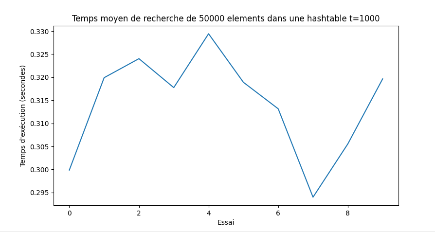

Pour 10 essais, le temps moyen de recherche de 100,000 éléments dans une table de hachage de taille 10000 comprenant des valeurs comprises entre 0 et 10000, est de : **0.60002** secondes

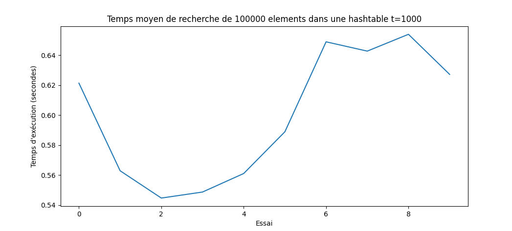

Pour 10 essais, le temps moyen de recherche de 500,000 éléments dans une table de hachage de taille 10000 comprenant des valeurs comprises entre 0 et 10000, est de : **2.17633** secondes

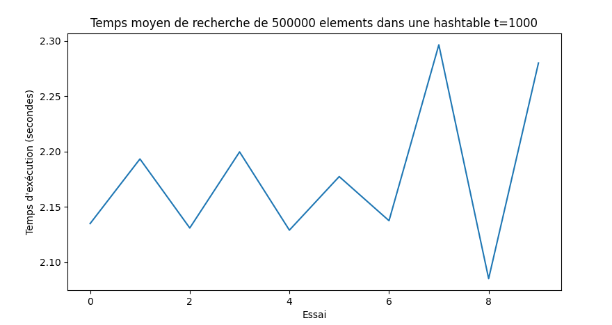

Pour 10 essais, le temps moyen de recherche de 1,000,000 éléments dans une table de hachage de taille 10000 comprenant des valeurs comprises entre 0 et 10000, est de : **5.77921** secondes

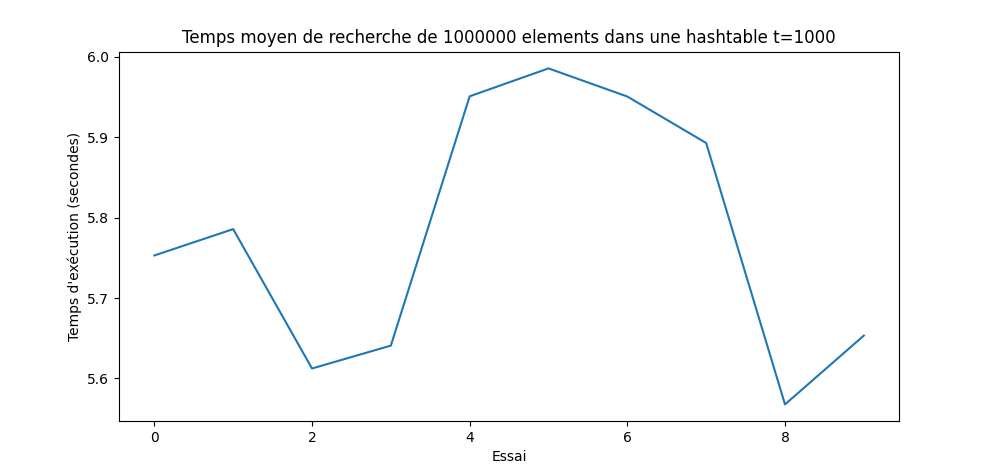

---

### Conclusion

Puisque notre implémentation Python des tables de hashage implique un re-hashage quand une clé est placé sur un index déjà alloué et qu'il y a un certain nombre de collisions, la complexité pour cette structure est de O(n).
Par conséquent, pour l'opération de recherche d'une valeur, l'arbre binaire de recherche est bien plus performant dans cet environnement.  
Les tests ont étés réalisés sur un ordinateur HP Probook 450G6.

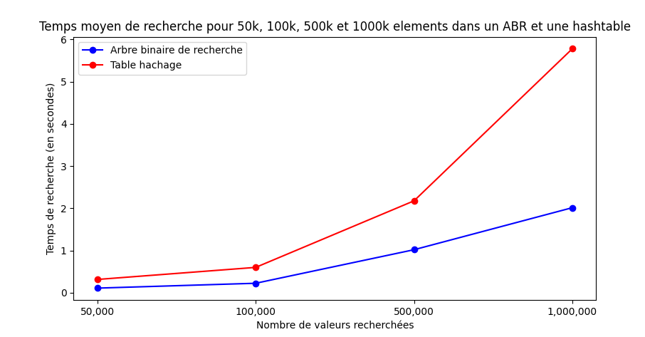

 
 

# Visualisation de l'etude sous forme d'arbre

---

L'arbre binaire qui va etre utiliser pour l'etude est le suivant. On le nomme A:

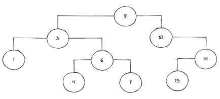

_Schéma - Arbre binaire A_

 

## Test des différentes fonctions :

Arbre binaire A auquel on a retiré le noeud 6 :

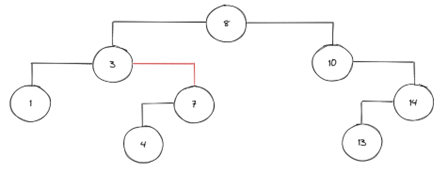

_Schéma - Arbre binaire A privé du noeud 6_

 

Les elements en dessous du noeud supprimé sont replacés dans l'arbre de façon à respecter l'ordre. Pour la suite, nous garderons cet arbre. On le nomme A_bis.
 
 

# Union de 2 arbres

L'union de 2 arbre signifie creer un nouvel arbre qui comprend les elements du premier arbre et ceux du deuxieme.

Union de 2 ensembles :

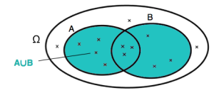

_Illustration - Union de 2 ensembles_

 

## Union de l'arbre A_bis et B :

 

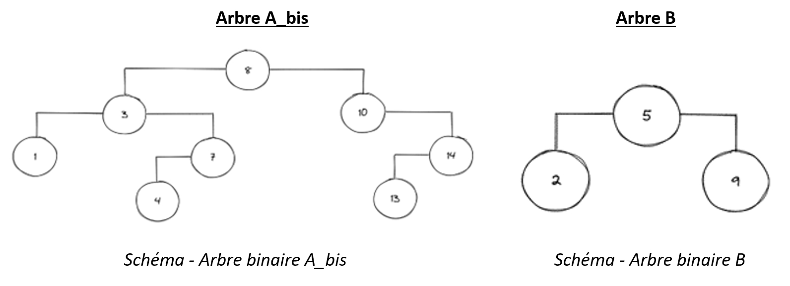

_Schéma - Arbre binaire A_bis_

 

### Resultat de l'union :

Union de l'arbre binaire A_bis et de l'arbre binaire B :
 
 

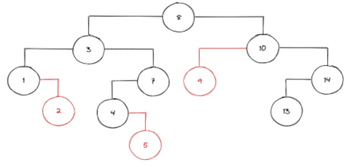

_Schéma - Union de l'arbre A_bis et l'arbre B_

 

## Intersection de 2 arbres :

L'intersection de 2 arbres signifie creer un arbre comportant les elements qui sont communs aux deux arbres selectionnés.
 
 

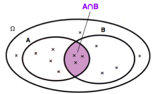

_Illustration - intersection de 2 ensembles_

 

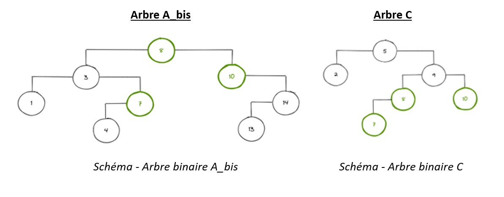

_Schéma - Arbre binaire A_bis - En vert : membres de l'intersection avec l'arbre A_bis et C (arbre C ci-dessous)_

 

### Resultat de l'intersection :

Intersection de l'arbre A_bis et l'arbre C :
 
 

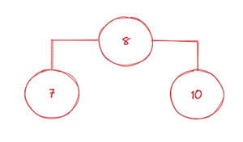

_Intersection de l'arbre binaire A_bis et l'arbre binaire C_

 

Seuls les elements communs aux 2 arbres binaire constituent le nouvel arbre.
 
 

# Sources

Definition unions et intersections :
https://lecluseo.scenari-community.org/2DE/Probabilites/co/G_IntersectionUnion.html
- Stack Overflow, https://stackoverflow.com  
- Leetcode, https://leetcode.com  
- ChatGPT, https://chat.openai.com  
- Wikipédia, https://fr.wikipedia.org/wiki/Arbre_binaire_de_recherche / https://fr.wikipedia.org/wiki/Table_de_hachage  
- Unisciel, https://ressources.unisciel.fr/algoprog/s46bst/emodules/br00macours1/res/br00cours-texte-xxx.pdf / https://ressources.unisciel.fr/algoprog/s44htable/emodules/ht00macours1/res/ht00cours-texte-xxx.pdf
